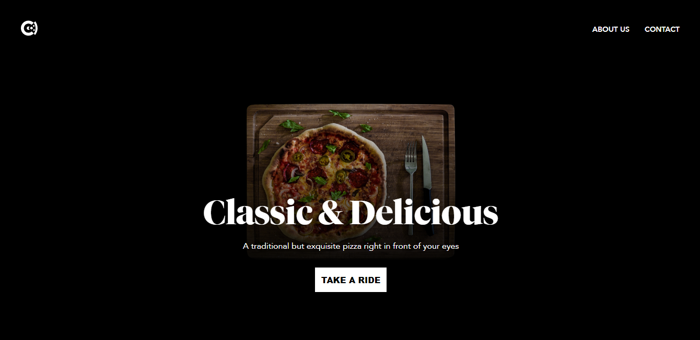
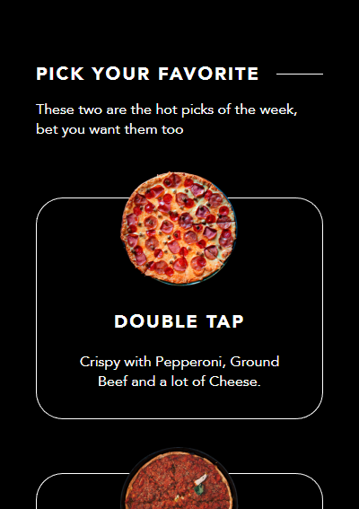
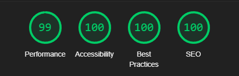
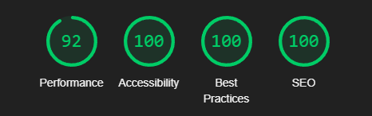

# Cipriani's Pizza

[ciprianipizza.vercel.app](https://ciprianipizza.vercel.app) is a static landing page for a pizza business called Cipriani's Pizza.

It's pretty basic but I wanted to keep it simple, you know, like 'bare-bones' programming.

---

### Stack
- HTML
- CSS
- JavaScript

---

### Some details

- Mobile-first, fully reponsive, one different UI for desktop, tablets and mobile devices.
- Retro-compatibility with old iOS/Firefox/IE versions.
- Made a simple hamburguer menu
- Parallax effects included (without using external libs) *hell yeah*.
- Using WebP images by default but having PNG as fallback

---

### Lighthouse benchmarks

Yeah this project is quite basic but I still add these screenshots for the sake of good practices (;

#### Desktop

#### Mobile

> The performance is a little bit worse due to the use of .PNG instead of .WEBP images

It had been a long time since I had played with HTML/JS without any modern framework so this was fun :)

---

